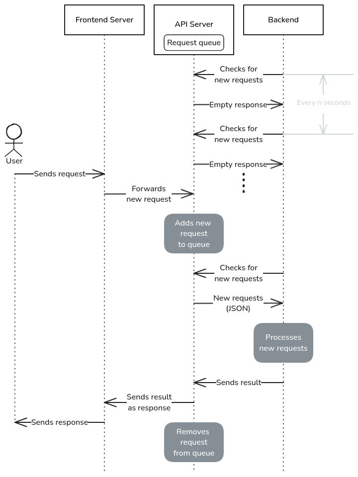

# API request handling

The original NUS VM web server hosting the LetsCheck HTML pages lacks the resources needed to host the dataset and run models directly. Therefore, the backend applications are deployed on machines located in the IDS office. However, these IDS machines cannot be accessed directly from the NUS VM.

To work around this, both Twatch and Quin have their own API servers with exposed endpoints to facilitate communication with the backend applications.

The diagram below explains how this setup functions. The request handling process is implemented in Twatch/backend-api and Quin/frontend. The difference in naming exists due to legacy reasons.

