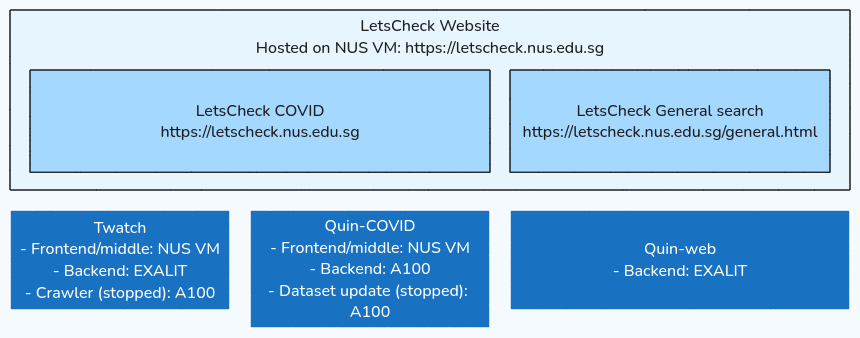

# LetsCheck deployment overview

## LetsCheck Website (`letscheck-html`)

The public-facing LetsCheck website is a static HTML site hosted on A600 workstation using Caddy.

The site features demos for two projects: LetsCheck COVID and LetsCheck General Search.

- LetsCheck COVID is the original fact-checking project, divided into three sections that handle different information sources: Twitter, news, and scientific articles. The first section, Twatch, processes and analyzes COVID-related Twitter data. The other two sections use Quin, a model designed to fact-check statements against datasets, in this case, COVID-related news and scientific articles.
- LetsCheck General Search is based on a modified version of the Quin-general model. It first conducts a general web search for the query, then uses the Quin model to fact-check the results from the search.

## Twatch
Twatch offers a searchable archive of COVID-related claims circulating on X (formerly Twitter) from 2020 to 2023, along with visualizations showing their impact.

Twatch consists of the following components:

- **Frontend**: A web app built using the React library.
- **Backend-API**: For more details, see [this page](api-request-handling.md).
- **Backend (Data)**: A Python script that retrieves data from the tweet database.
- **[Crawler](twatch-crawler.md)**: Downloads tweet data from the [Panacea Lab dataset](https://github.com/thepanacealab/covid19_twitter). This component is currently inactive as the dataset is no longer being updated.

## Quin
Quin is a user-friendly framework designed for large-scale fact-checking and question answering. You can explore it on the [Github repository](https://github.com/algoprog/Quin). LetsCheck offers demos for two Quin models: Quin-COVID and Quin-web.

- **Quin-COVID**: Quin-COVID backend is deployed on the A6000 workstation. One instance is based on a dataset of news articles, while the other uses scientific articles from the [COVID-19 Open Research Dataset](https://github.com/allenai/cord19).
- **Quin-general**: An upgraded version of Quin that supports general queries and conducts fact-checking using web search results.
- **Quin-frontend**: For more details, refer to [this page](api-request-handling.md).

